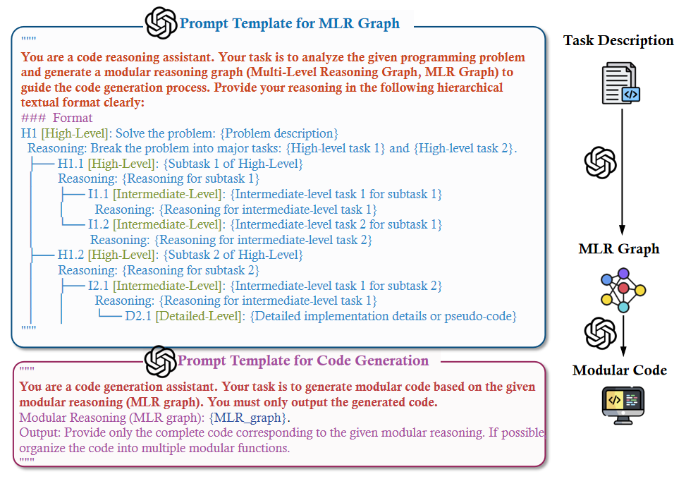
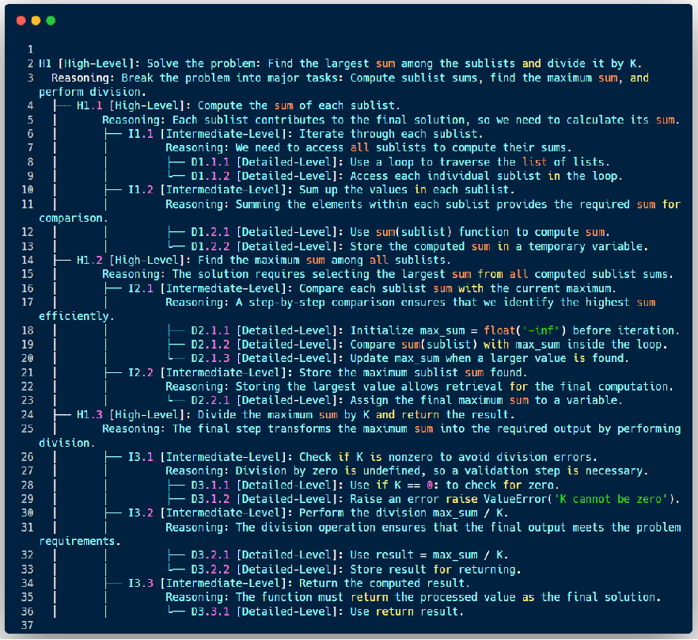

# Modularization-of-Thought Prompting for Effective Code Generation

## Introduction

This repository contains the implementation of our paper:

**"Modularization-of-Thought Prompting for Effective Code Generation"**

MoT is a planning-first prompting framework for code generation. It introduces a **Multi-Level Reasoning (MLR) Graph** as an intermediate representation between task decomposition and code generation, with the goal of improving the alignment between reasoning structure and generated code.

Our main contributions are as follows:

- **MoT prompting.** We propose a prompting framework that incorporates modularization principles from software development into the reasoning process of code generation.
- **MLR Graph.** We design a fixed-depth **Multi-Level Reasoning Graph** to structure hierarchical planning and improve reasoning-code alignment.
- **Comprehensive evaluation.** We evaluate MoT on multiple benchmarks and compare it with a diverse set of prompting and structured reasoning baselines.

The MoT prompt template is provided in `prompting_techniques/MoT.py`.


---

## Installation

Our code is implemented in Python and tested on Linux.

### Prerequisites

- Python >= 3.8

### Setup

Clone the repository and install dependencies:

```bash
git clone https://github.com/our_repo.git
cd Pass@1/evaluation
pip install -r requirements.txt
```

---

## Project Structure

The repository is organized as follows:

```text
📂 Modularization_of_Thought
├── 📂 APR
│   ├── APR_HumanEval+.py
│   ├── APR_HumanEval.py
│   ├── APR_HumanEval_ET.py
│   ├── APR_MBPP+.py
│   ├── APR_MBPP.py
│   └── APR_MBPP_ET.py
│
├── 📂 Dataset
│   ├── HumanEval+.jsonl
│   ├── HumanEval-ET.jsonl
│   ├── HumanEval-ET.jsonl.gz
│   ├── HumanEval.jsonl
│   ├── MBPP-ET.jsonl.gz
│   ├── MBPP_ET.jsonl
│   ├── MBPP_sanitized.jsonl
│   ├── MBPP_sanitized.jsonl.gz
│   ├── Mbpp+.jsonl
│   └── humaneval.jsonl
│
├── 📂 Pass@1
│   ├── 📂 evaluation
│   │   ├── __init__.py
│   │   ├── data.py
│   │   ├── evaluate_functional_correctness.py
│   │   ├── evaluation.py
│   │   └── execution.py
│   ├── requirements.txt
│   └── setup.py
│
├── 📂 experiments
│   ├── 📂 RQ1
│   │   ├── 📂 HumanEval_deepseek
│   │   ├── 📂 HumanEval_gpt-4o-mini
│   │   ├── 📂 MBPP_deepseek
│   │   └── 📂 MBPP_gpt-4o-mini
│   └── 📂 RQ2
│
├── 📂 prompting_techniques
├── 📂 tools
└── README.md
```

### Key Directories

- **`APR/`**: Automated program repair scripts for different datasets.
- **`Dataset/`**: Datasets used in evaluation.
- **`Pass@1/`**: Evaluation code for pass@1 and functional correctness.
  - **`evaluation/`**: Core evaluation scripts.
- **`experiments/`**: Experimental results and analysis.
- **`prompting_techniques/`**: Implementations of prompting strategies.
- **`tools/`**: Utility scripts for data processing and experiment management.

### Prompting Baselines Included

- **Zero-shot prompting**: Generates code directly from the problem description.
- **Few-shot prompting**: Uses a small number of in-context examples.
- **Chain-of-Thought (CoT)**: Uses step-by-step reasoning before generation.
- **Self-Planning**: Generates an explicit plan before coding.
- **SCoT**: Incorporates more structured program-oriented reasoning.
- **CodeCoT**: Combines reasoning with code-focused self-checking.

---

## Additional Experimental Results

This page reports the additional and revised experimental results included in the major revision. These results extend the evaluation of MoT to recent contest-style code generation, repository-level code generation, real-world bug-fixing tasks, depth analysis, robustness analysis, and comparisons with agent-based and structured reasoning methods.

---

### 1. Full LiveCodeBench and RAL-Bench Results

To reduce concerns about benchmark saturation and to further evaluate MoT beyond standard function-level benchmarks, we additionally evaluate all studied prompting techniques on the full **LiveCodeBench release_v5** and **RAL-Bench**.

LiveCodeBench contains **1,055 recent programming problems** and is used to evaluate recent contest-style code generation. RAL-Bench evaluates repository-level code generation using functional system tests.

#### GPT-4o-mini

| Method | LiveCodeBench Pass@1 | RAL-Bench Fun. |
| --- | ---: | ---: |
| Zero-shot | 26.7 | 12.2 |
| Few-shot | 27.7 | 10.6 |
| CoT | 33.6 | 13.5 |
| Self-Planning | 21.9 | 15.4 |
| SCoT | 27.9 | 16.1 |
| CodeCoT | 33.8 | 16.4 |
| **MoT** | **38.3** | **25.8** |

On **GPT-4o-mini**, MoT achieves **38.3 Pass@1** on LiveCodeBench and **25.8 Fun.** on RAL-Bench, outperforming the strongest baseline by **4.5** and **9.4** points, respectively.

#### DeepSeek-R1

| Method | LiveCodeBench Pass@1 | RAL-Bench Fun. |
| --- | ---: | ---: |
| Zero-shot | 64.8 | 16.2 |
| Few-shot | 69.0 | 37.3 |
| CoT | 74.2 | 36.0 |
| Self-Planning | 66.4 | 40.8 |
| SCoT | 64.7 | 44.0 |
| CodeCoT | 67.3 | 45.1 |
| **MoT** | **75.3** | **46.2** |

On **DeepSeek-R1**, MoT also achieves the best results, with **75.3 Pass@1** on LiveCodeBench and **46.2 Fun.** on RAL-Bench.

These results show that MoT remains effective in both recent contest-style code generation and repository-level code generation settings.

---

### 2. MLR Graph Depth Analysis

We evaluate the impact of different MLR graph depths using **GPT-4o-mini**. The evaluation covers both function-level benchmarks and a repository-level benchmark, including **HumanEval**, **HumanEval+**, and **RAL-Bench**.

| Graph Depth | HumanEval Pass@1 | Δ vs Avg (%) | HumanEval+ Pass@1 | Δ vs Avg (%) | RAL-Bench Fun. | Δ vs Avg (%) |
| --- | ---: | ---: | ---: | ---: | ---: | ---: |
| 1 layer | 83.5 | -4.1 | 75.6 | -4.6 | 22.1 | -5.8 |
| 2 layers | 85.4 | -1.9 | 79.9 | 0.8 | 22.2 | -5.7 |
| **3 layers** | **92.1** | **5.8** | **83.5** | **5.4** | **25.8** | **10.0** |
| 4 layers | 87.2 | 0.2 | 78.0 | -1.6 | 23.9 | 1.5 |
| Average | 87.1 | 0.0 | 79.3 | 0.0 | 23.5 | 0.0 |

The results show that the **3-layer MLR hierarchy** achieves the best empirical trade-off across both function-level and repository-level settings. Shallower hierarchies may lack sufficient structured guidance, while deeper hierarchies can introduce redundancy, fragmentation, and coordination overhead.

Therefore, MoT adopts **3 layers** as the default depth.

---

### 3. Robustness under Prompt Perturbations

We further evaluate whether MoT is robust to small variations and noisy perturbations in problem descriptions. The experiment is conducted on **HumanEval** using **GPT-4o-mini**.

We apply three types of controlled perturbations:

- **Synonym substitution**, such as replacing “calculate” with “compute”.
- **Word-order shuffling** within sentences.
- **Character-level typos**, such as replacing “return” with “retrun”.

For each metric, we report the relative change from the original-prompt setting to the perturbed-prompt setting. Smaller absolute changes indicate better robustness.

| Method | Synonym ΔPass@1 | Synonym ΔBLEU | Synonym ΔEdit | Shuffle ΔPass@1 | Shuffle ΔBLEU | Shuffle ΔEdit | Typos ΔPass@1 | Typos ΔBLEU | Typos ΔEdit |
| --- | ---: | ---: | ---: | ---: | ---: | ---: | ---: | ---: | ---: |
| CoT | -1.83% | +0.12% | -0.17% | -50.00% | -1.01% | +0.86% | +0.61% | +0.10% | -0.35% |
| Self-Planning | +5.49% | -0.51% | +0.81% | -47.56% | -4.22% | +7.08% | -0.61% | -0.55% | +1.08% |
| SCoT | +1.83% | -1.13% | +0.70% | -52.44% | -3.53% | +4.71% | -2.44% | -0.13% | +0.30% |
| CodeCoT | -1.22% | +0.33% | +0.10% | -54.88% | -2.84% | +3.59% | -4.27% | +0.11% | -0.92% |
| **MoT** | **-1.22%** | **-0.55%** | **-0.17%** | **-39.63%** | **-2.35%** | **+0.71%** | **-0.34%** | **-0.12%** | **-0.29%** |

Word-order shuffling is the most disruptive perturbation, but MoT shows the smallest Pass@1 drop under this setting. Under character-level typos, MoT also has the smallest Pass@1 change. These results suggest that MoT is comparatively stable under noisy and ambiguous prompt variations.

---

### 4. Preliminary SWE-bench Lite Study

To examine whether MoT can be applied to real-world repository editing tasks, we conduct a preliminary study on the official **SWE-bench Lite** set. This benchmark contains **300 real-world software issue tasks**.

We use **GPT-4o-mini** and compare MoT with Direct and CodeCoT under the same issue description, repository context, patch-generation protocol, and test-execution protocol.

| Method | SWE-bench Lite Score |
| --- | ---: |
| Direct | 1.00 |
| CodeCoT | 1.33 |
| **MoT** | **2.33** |

MoT achieves competitive performance among the compared methods. This preliminary result suggests that MoT can be applied to repository editing tasks beyond standalone code generation.

However, this experiment should be interpreted as preliminary evidence. More comprehensive evaluation on real-world software engineering benchmarks, especially with stronger retrieval, localization, and feedback-driven repair mechanisms, remains future work.

---

### 5. Comparison with Agent-Based Methods

To complement the prompting-only comparisons in the main evaluation, we further compare MoT with representative **agent-based repository-level code generation methods**.

This comparison is conducted on **NL2Repo-Bench** and **RAL-Bench** using **GPT-5** as the shared backbone.

| Method | NL2Repo Overall | Easy | Medium | Hard | RAL-Bench Fun. |
| --- | ---: | ---: | ---: | ---: | ---: |
| Direct | 21.7 | 38.4 | 20.7 | 9.6 | 38.5 |
| SE-Agent | 25.4 | **44.5** | 23.6 | 12.6 | 44.7 |
| AlphaEvolve | 25.1 | 41.8 | 25.1 | 11.7 | 43.7 |
| CSE | 19.7 | 41.1 | 15.8 | 7.9 | 34.3 |
| **MoT** | **29.7** | 34.8 | **36.8** | **20.7** | **46.2** |

MoT achieves the best overall result on **NL2Repo-Bench** and the highest functional score on **RAL-Bench**. Its advantage is especially clear on the **Medium** and **Hard** subsets of NL2Repo-Bench, where MoT achieves **36.8** and **20.7**, respectively.

These results suggest that MoT is effective for repository-level code generation tasks. A likely reason is that MoT introduces a generation-aware hierarchical plan that directly connects task decomposition with downstream code generation, while avoiding the additional coordination or search complexity of agent-based methods.

---

### 6. Comparison with Structured Reasoning and Refinement Methods

We also compare MoT with representative structured reasoning and refinement methods, including **Tree-of-Thoughts (ToT)**, **Graph-of-Thoughts (GoT)**, **Parsel**, **CodeChain**, and **CodeTree**.

This comparison is conducted on **HumanEval** and **RAL-Bench** using **GPT-4o-mini** as the shared backbone. Unlike the agent-based comparison, this experiment reports both effectiveness and full-benchmark cost.

| Method | HumanEval Pass@1 | RAL-Bench Fun. | HumanEval Token Cost | HumanEval Time (s) | RAL-Bench Token Cost | RAL-Bench Time (s) |
| --- | ---: | ---: | ---: | ---: | ---: | ---: |
| ToT | 84.1 | 8.5 | 1817.3 | 15.58 | 4949.0 | 36.81 |
| GoT | 90.2 | 16.6 | 2712.3 | 20.04 | 4546.1 | 34.99 |
| Parsel | 71.8 | 14.0 | 2784.7 | 19.95 | 5489.4 | 32.14 |
| CodeChain | 90.9 | 15.3 | 4323.0 | 25.43 | 8389.9 | 45.93 |
| CodeTree | 84.8 | 13.3 | 3503.6 | 21.18 | 9722.1 | 52.06 |
| **MoT** | **92.1** | **25.8** | **783.7** | **5.12** | **3431.63** | **31.69** |

MoT achieves strong performance on both **HumanEval** and **RAL-Bench**, while also maintaining favorable efficiency. Compared with structured reasoning and refinement methods, MoT does not rely on heavy search, backtracking, or iterative refinement, which helps reduce token usage and runtime.

---

## Illustrative Example: Problem, Prompts, MLR Graph, and Generated Code

This section presents an end-to-end example showing how the **Multi-Level Reasoning (MLR) Graph** supports modular code generation.

We provide:

1. A **problem description**.
2. The **prompt templates** used to construct the MLR Graph and generate code.
3. A generated **MLR Graph**.
4. The final **modular code**.

### Prompt Template for MLR Graph

```python
You are a code reasoning assistant. Your task is to analyze the given programming problem and generate a modular reasoning graph (Multi-Level Reasoning Graph, MLR Graph) to guide the code generation process. Provide your reasoning in the following hierarchical textual format clearly:
### Format
H1 [High-Level]: Solve the problem: {Problem description}
  Reasoning: Break the problem into major tasks: {High-level task 1} and {High-level task 2}.
  ├── H1.1 [High-Level]: {Subtask 1 of High-Level}
  │       Reasoning: {Reasoning for subtask 1}
  │       ├── I1.1 [Intermediate-Level]: {Intermediate-level task 1 for subtask 1}
  │       │         Reasoning: {Reasoning for intermediate-level task 1}
  │       └── I1.2 [Intermediate-Level]: {Intermediate-level task 2 for subtask 1}
  │                 Reasoning: {Reasoning for intermediate-level task 2}
  ├── H1.2 [High-Level]: {Subtask 2 of High-Level}
  │       Reasoning: {Reasoning for subtask 2}
  │       ├── I2.1 [Intermediate-Level]: {Intermediate-level task 1 for subtask 2}
  │       │         Reasoning: {Reasoning for intermediate-level task 1}
  │       │         └── D2.1 [Detailed-Level]: {Detailed implementation details or pseudo-code}
```

### Prompt Template for Code Generation

```python
You are a code generation assistant. Your task is to generate modular code based on the given modular reasoning (MLR graph). You must only output the generated code.
Modular Reasoning (MLR graph): {MLR_graph}.
Output: Provide only the complete code corresponding to the given modular reasoning. If possible, organize the code into multiple modular functions.
```

### Visualization of the Prompting Process



### Problem Description

**Task:**
You are given a list of lists (an array of arrays) and an integer **K**. The goal is to **find the largest sum among the sublists** and then **divide this sum by K**.

### Generated MLR Graph



### Generated Modular Code

```python
def validate_input(K):
    """D3.1.1: Check if K is zero"""
    if K == 0:
        raise ValueError("K cannot be zero")


def compute_sublist_sum(sublist):
    """D1.2.1: Compute sum using sum() function"""
    return sum(sublist)


def find_max_sublist_sum(array):
    """D2.1.1: Initialize max sum and find the maximum sublist sum"""
    max_sum = float('-inf')

    for sublist in array:
        sublist_sum = compute_sublist_sum(sublist)
        if sublist_sum > max_sum:
            max_sum = sublist_sum

    return max_sum


def divide_max_sum(max_sum, K):
    """D3.2.1: Perform division"""
    return max_sum / K


def largest_sum(array, K):
    """Main function that orchestrates modularized components"""
    validate_input(K)
    max_sum = find_max_sublist_sum(array)
    return divide_max_sum(max_sum, K)
```


